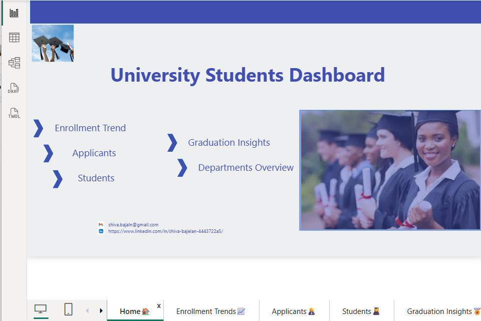
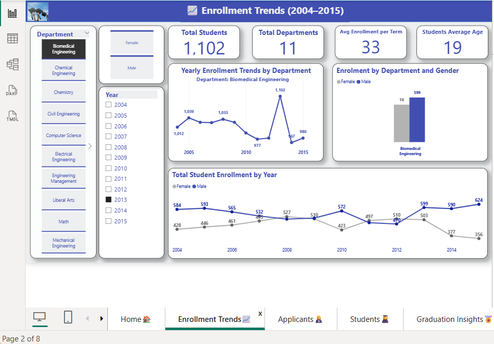
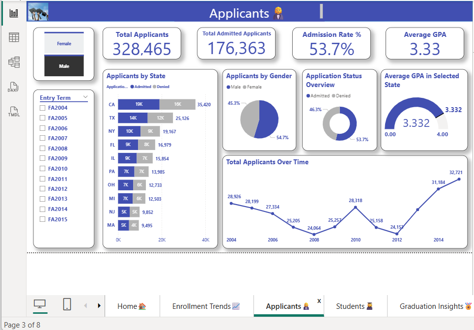
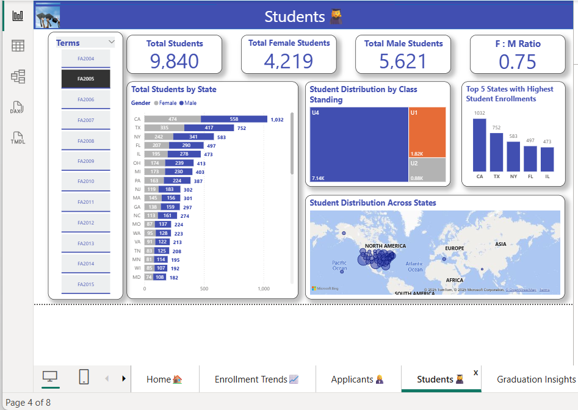
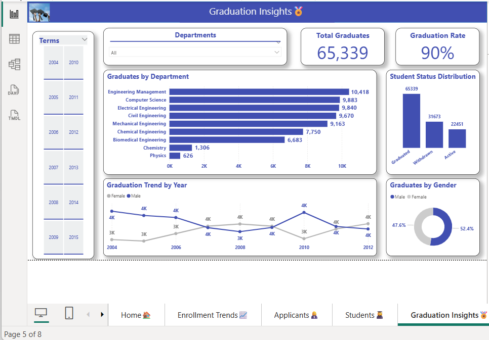
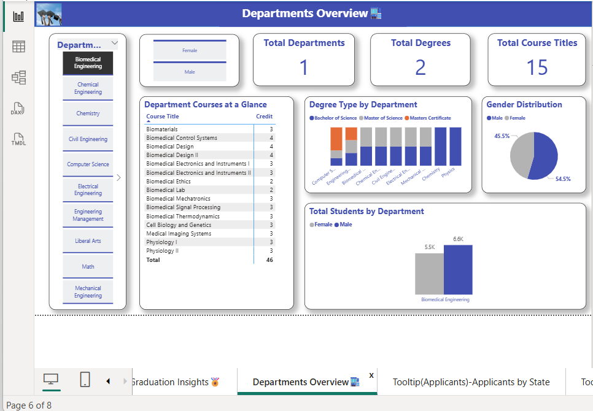
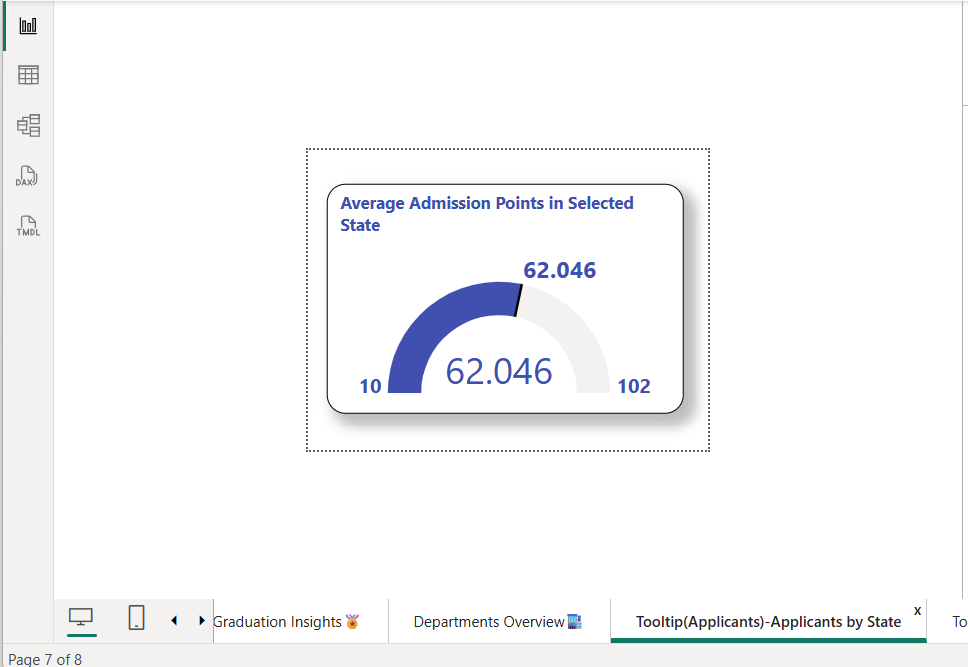
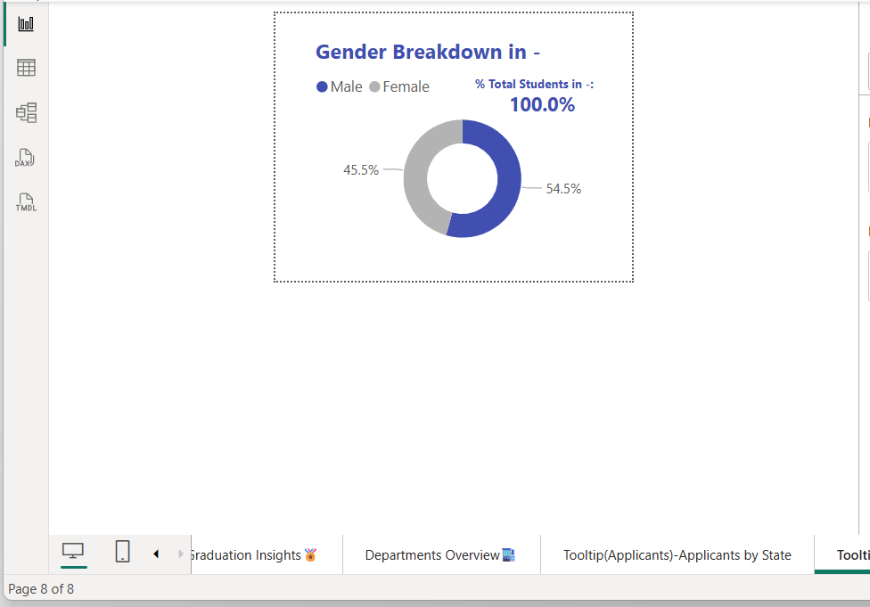

# 🎓 university-students-powerbi-dashboard
## 📌 Project Overview

This project presents an interactive Power BI dashboard designed to provide insights into university students’ data. It allows stakeholders (e.g., administrators, academic planners, and faculty) to explore and analyse students’ demographics, academic distribution, and department-level details.

The dashboard is structured into multiple tabs, each focusing on specific aspects of the data, with slicers and KPIs for quick filtering and decision-making.

## 📊 Dashboard Features
1. Home Tab
   
- central navigation hub with a clean design to guide users to each section.
   

2. Enrolment Trend Tab

- Slicers for Gender, Year, and Department.

- Yearly enrolment trend line chart.

- Enrolment by department and gender (stacked column chart).

- KPIs: Total Students, Total Departments, Avg Enrolment per Year, Students’ Avg Age.
    

3. Applicants Tab

- Gender and Year Entry slicers.

- Applicants by State (horizontal bar chart).

- Admission outcomes (donut chart for admitted vs denied).

- Applicant gender distribution (pie chart).

- KPIs: Total Applicants, Total Admitted Applicants, Admission Rate %, Avg GPA.
 
 

4. Students Tab

- Term and Year slicers.

- Student distribution by state (bar chart + map with bubble distribution).

- Class Standing distribution (treemap).

- Top 5 states with highest student enrolment (column chart).

- KPIs: Total Students, Total Female Students, Total Male Students, F:M Ratio.

  

5. Graduation Insights Tab

- Term and Department slicers.

- Graduates by department (horizontal bar chart).

- Student status distribution (Active, Withdrawn, Graduated).

- Graduation trend by year (line chart).

- Graduate gender distribution (donut chart).

- KPIs: Total Graduates, Graduation Rate.

  

6. Department Overview Tab

- Department and Gender slicers.

- Table of courses per department with credit requirements.

- Degree types by department (stacked column chart: Bachelor, Master, Certificate).

- Gender distribution within each department (pie chart).

- Student numbers by department and gender (column chart).

- KPIs: Total Departments, Total Degrees, Total Course Titles.

7. Tooltip Tabs

Two additional pages designed as tooltips to provide drill-through and hover insights on selected visuals. 

## 🛠️ Skills & Tools Used

- Power BI: Data modelling, DAX measures, slicers, custom tooltips, interactive visuals.

- Data Transformation: Cleaned and structured raw data for fact and dimension modelling.

- Visual Design: Created a user-friendly, professional layout with a mix of KPIs, charts, and maps.

## ✅ Conclusion & Next Steps

This dashboard provides a holistic view of the student lifecycle from application to graduation. It enables university stakeholders to:

Track enrolments and applicants in real time.

Identify demographic and geographic trends.

Monitor department performance and graduation outcomes.

Next steps could include integrating predictive analytics (e.g., forecasting enrolments, dropout risk analysis) and automating data refresh for real-time insights.
